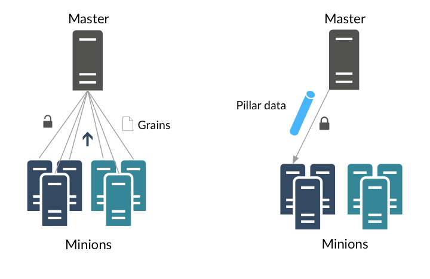

# DevOps Clinic - Notes for Salt Project Pillars and Grains

In this video we talked about what Pillars and Grains are in Salt and how to use them.



## Documentation Links
- [Grains Execution Module](https://docs.saltproject.io/en/latest/ref/modules/all/salt.modules.grains.html#module-salt.modules.grains)
- [Pillar Execution Module](https://docs.saltproject.io/en/latest/ref/modules/all/salt.modules.pillar.html#module-salt.modules.pillar)
- [Grains State Module](https://docs.saltproject.io/en/latest/ref/states/all/salt.states.grains.html#module-salt.states.grains)
- [SLS Template Variable Reference](https://docs.saltproject.io/en/latest/ref/states/vars.html)
- [Targeting Minions](https://docs.saltproject.io/en/latest/topics/targeting/index.html)
- [Targeting Minions with Compound Query](https://docs.saltproject.io/en/latest/topics/targeting/compound.html#targeting-compound)

## Grains CLI
```
# Query the minion for all grains
salt 'web*' grains.items

# Query the minion for just the grain called host.  grains.item displays the key and value in the results
salt 'web*' grains.item host

# Query the minion for just the grain called host.  grains.get displays only the value in the results, not the key name
salt 'web*' grains.get host

# Query the minion for the dns grain and narrow down to specific sub-keys
salt 'web*' grains.get dns
salt 'web*' grains.get dns:ip4_nameservers
salt 'web*' grains.get dns:ip4_nameservers:0
salt 'web*' grains.get dns:ip4_nameservers:1

# Query the minion and output results as json
salt '*' grains.get host --output=json

# Target minions based on grains
salt -G 'os:Rocky' grains.get os
salt -G 'osfinger:Rocky Linux-8' grains.get osfinger
salt -C 'G@os_family:RedHat and G@osmajorrelease:8' grains.get osfullname

# Set a custom grain
salt 'web*' grains.set role webserver
salt 'db*' grains.set role dbserver
salt 'salt*' grains.set role saltserver
salt '*' grains.get role

# Delete a custom grain
salt '*' grains.delkey role

```

## Pillar CLI
```
# Show all pillar data for minion
salt 'web*' pillar.items

# Show a specific pillar key for minions and show both the pillar key and value
salt '*' pillar.item foo

# Show a specific pillar value for minion, but do not show the key name
salt '*' pillar.get foo

# Query the minion for the web pillar and narrow down to specific sub-keys
salt 'web*' pillar.get web
salt 'web*' pillar.get web:website
salt 'web*' pillar.get web:website:version

```
